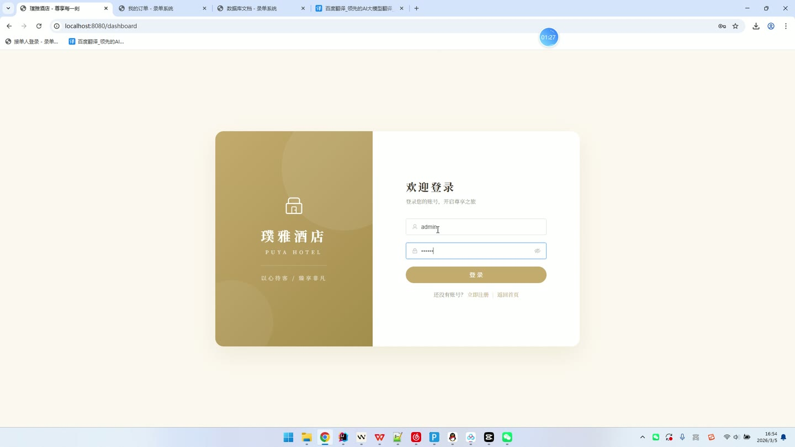
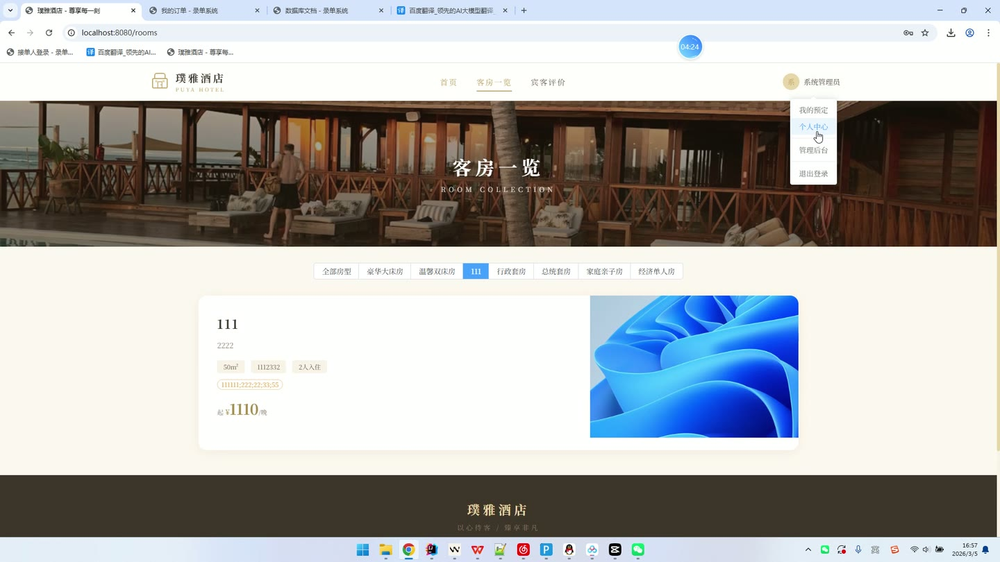
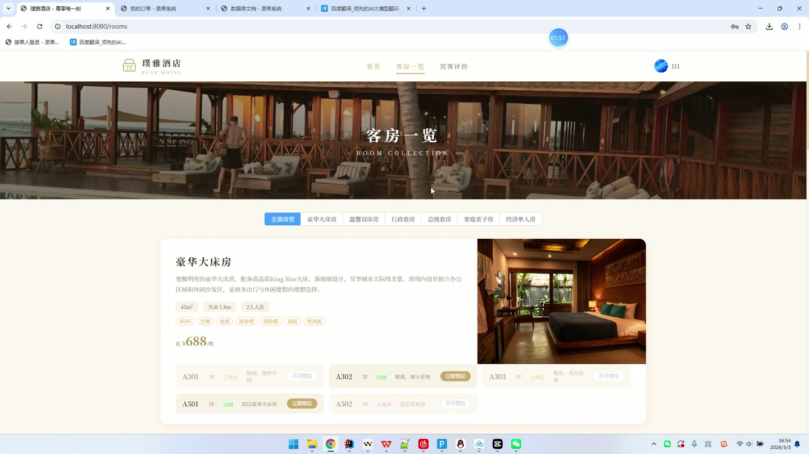
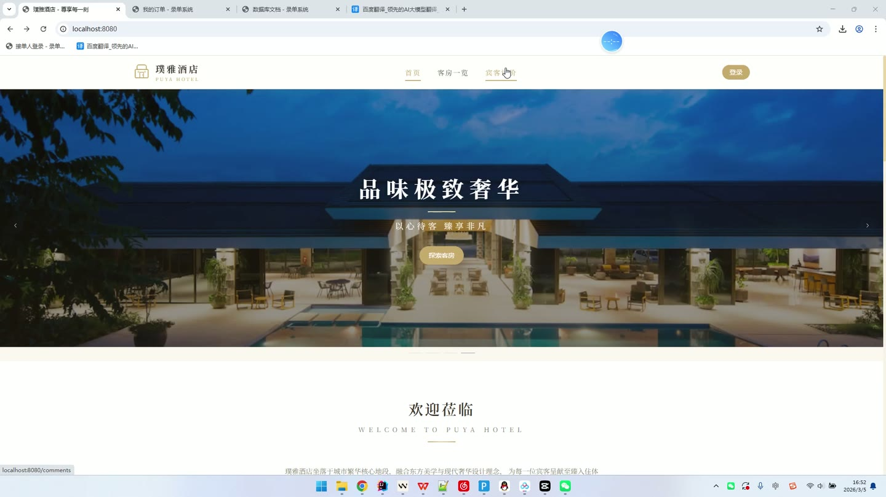
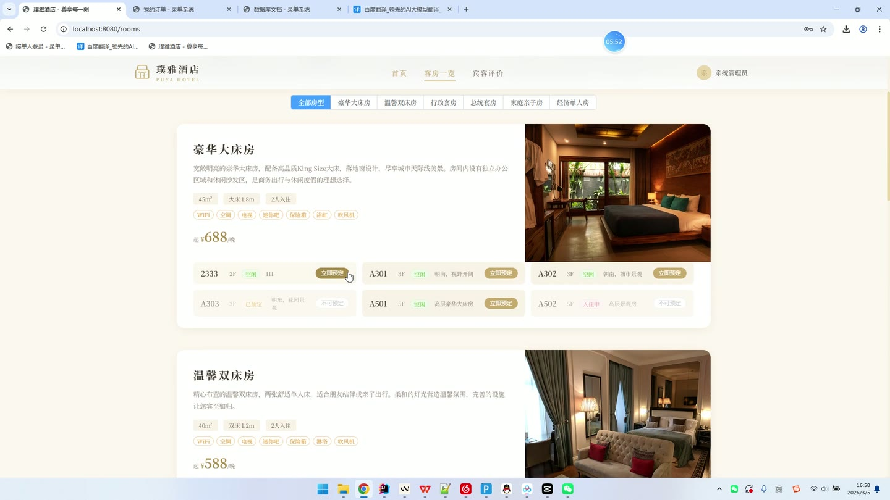

# (附文档)Springboot3+Vue3+MySQL 酒店客房管理系统

**技术栈**：Springboot3、Vue3、MySQL

### 系统简介

本系统为基于 SpringBoot3 + Vue3 + MySQL 的酒店客房管理系统，采用前后端分离架构。系统包含普通用户端与管理端两大角色，普通用户可浏览房型、在线预定客房、查看个人订单及发表评价；管理端可对用户、房型、房间、订单、评价及首页轮播图进行全流程管理。系统内置完整的房间状态流转机制（空闲/已预定/入住中/维护中），并支持文件上传、密码加密、会话管理等基础能力。

 
### 核心功能
 
### 普通用户端

 
- 用户注册：填写用户名、密码、真实姓名、手机号完成注册，系统自动校验用户名唯一性，密码经 MD5 加密后存储，注册成功默认角色为普通用户、状态为启用。 
- 用户登录：输入用户名与密码进行登录，系统校验密码正确性及账号状态（禁用账号无法登录），登录成功后写入会话并返回用户信息（密码脱敏）。 
- 查看首页轮播图：获取启用状态的轮播图列表，按排序值升序展示在首页轮播区域。 
- 浏览房型列表：查看启用状态的房型列表，展示房型名称、描述、基础价格、可住人数、床型、面积、设施标签等信息。 
- 查看房间列表：查看所有房间列表，展示房间号、所属房型、楼层、价格、状态（空闲/已预定/入住中/维护中），支持按房型筛选可预定房间。 
- 查看房间详情：通过房间 ID 查看单个房间的详细信息，包括房间号、房型名称、价格、楼层、图片等。 
- 在线预定客房：选择入住日期与退房日期（自动校验日期合法性，退房日期必须晚于入住日期）、填写入住人姓名、联系电话及备注，系统自动计算入住晚数与总价，生成唯一订单号（ORD+日期+随机数），预定成功后房间状态自动变为"已预定"。 
- 查看我的订单：查看当前用户的所有预定订单，展示订单号、房间号、房型、入住/退房日期、总价、订单状态（待确认/已确认/已入住/已退房/已取消）等完整信息。 
- 发表评价：针对已入住房型提交评价内容与评分（星级），评价默认状态为显示，可在前台公开展示。 
- 查看公开评价：浏览所有状态为"显示"的宾客评价，展示评价用户、房型、评分、评价内容及酒店回复。 
- 个人资料修改：修改真实姓名、手机号、邮箱、头像等个人资料信息。 
- 修改密码：输入原密码与新密码进行密码修改，系统校验原密码正确性，新密码经 MD5 加密后保存。 
- 退出登录：销毁当前会话，安全退出系统。
 
### 管理员端

 
- 数据看板：统计并展示用户总数、客房总数、预定总数、评价总数四项核心指标，同时展示最近预定订单列表与最新评价内容。 
- 用户管理：查看用户列表（支持按用户名/姓名/手机号模糊搜索），新增用户（设置用户名、密码、角色、状态），编辑用户信息（可修改密码、角色、状态），删除用户，支持管理员/工作人员/普通用户三种角色。 
- 房型管理：维护房型信息，包括房型名称、描述、图片、基础价格、可住人数、床型、面积、设施（逗号分隔）、排序值、启用状态；支持新增、编辑、删除房型。 
- 房间管理：维护房间信息，包括房间号（唯一）、所属房型、楼层、图片、备注、状态（空闲/已预定/入住中/维护中）；支持新增、编辑、删除房间，并可快速修改房间状态。 
- 订单管理：查看全部预定订单（含订单号、用户、房间、房型、入住人、电话、日期、总价、状态），按订单状态执行操作：待确认→确认、已确认→入住、已入住→退房、待确认/已确认→取消；取消或退房后房间状态自动恢复为"空闲"，入住后房间状态自动变为"入住中"；支持删除订单记录。 
- 评价管理：查看全部用户评价（含用户、房型、评分、内容、回复、显示状态），对评价进行回复，切换评价显示/隐藏状态，删除违规评价。 
- 轮播图管理：维护首页轮播图，包括标题、图片、链接、排序值、启用状态；支持新增、编辑、删除轮播图。 
- 文件上传：支持上传本地图片（jpg/png 等格式），上传成功后返回可访问的图片 URL，用于房型、房间、轮播图等图片设置。
 
### 技术栈

  后端框架 Spring Boot 3.x   ORM 框架 MyBatis-Plus（含自定义 SQL 注解查询）   权限方案 HttpSession 会话管理 + 角色字段（ADMIN/STAFF/USER）   前端框架 Vue 3（Composition API + Script Setup）   状态管理 Pinia（用户状态存储）   UI 组件库 Element Plus   路由方案 Vue Router（History 模式）   构建工具 Vite   数据库 MySQL（数据库名 hotel_room）   密码加密 Hutool DigestUtil（MD5）   文件上传 Spring MultipartFile + 本地磁盘存储   跨域处理 Spring WebConfig 全局 CORS 配置 
 
### 交付内容

 
- 后端完整源码 
- 前端完整源码 
- 数据库初始化脚本 
- 万字文档

## 界面展示

---

## 获取完整源码 + 万字文档

本仓库为项目介绍页。**完整前后端源码、数据库初始化脚本、万字项目文档**，请加微信 `kangkangcode`，或访问 [codekk.top](http://codekk.top) 获取。

可作课程设计 / 毕业设计参考，支持远程部署调试。